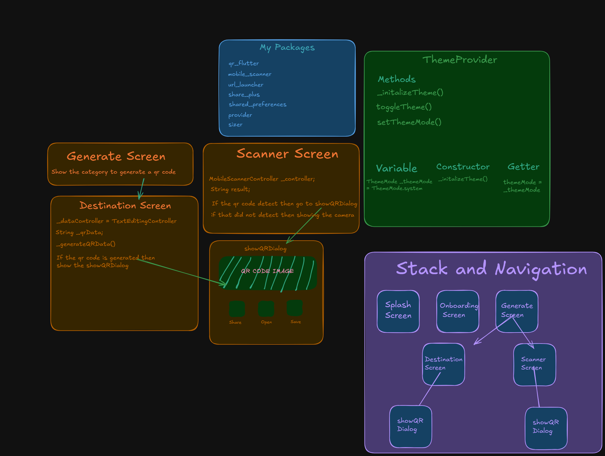

# 🚀 MeshCode – Simplifying Your Daily QR Code Tasks


## Overview 💁🏻

**MeshCode** is a powerful and intuitive QR code scanner and generator designed to make your daily life easier. Whether you need to scan QR codes on the go or generate QR codes for text, SMS, WhatsApp, email, websites, phone numbers, or WiFi, MeshCode has got you covered. 

With built-in functionality to save QR codes to your gallery, share them across multiple platforms, and instantly open scanned links, MeshCode ensures seamless QR code management for personal and professional use.

**Effortlessly scan, generate, save, and share QR codes with MeshCode!**

---

## 📷 Screenshots

### Light Mode ☀


---

### Dark Mode 🌙


---

## 🌟 Key Features:

- 📷 **Scan QR Codes**: Quickly scan and decode QR codes with ease.
- 🔗 **Generate QR Codes**: Create QR codes for text, SMS, WhatsApp, email, websites, phone numbers, and WiFi.
- 💾 **Save QR Codes to Gallery**: Store generated QR codes for future use.
- 📤 **Share QR Codes**: Easily share QR codes via social media, messaging apps, or email.
- 🔍 **Open QR Links**: Instantly open scanned QR codes in the relevant app or browser.
- 🌙 **Dark & Light Mode Support**: Choose between dark and light themes for a better experience.
- 🚀 **Optimized Performance**: Fast and smooth QR scanning and generation.

## 🎨 Design & Behind the Scenes

- **Figma Design**: [View Design](https://www.figma.com/design/Z2H8rsexX2N0EvCol1oLS6/MeshCode?node-id=0-1&t=aGEGzrDTWkl9NYQH-1)
- **Development Process**: 

---

## 🛠️ Tech Stack

- **Flutter** – Cross-platform development
- **Dart** – Fast and efficient language
- **Shared Preferences** – Local storage
- **Animated Splash Screen** – Splash screen animation
- **Provider** – State management
- **Sizer** - Make a responsive design
- **Mobile Scanner** – QR and barcode scanning
- **Permission Handler** – Manage camera and storage permissions
- **Share Plus** – Share QR codes and text
- **URL Launcher** – Open external links
- **Gallery Saver** – Save QR codes to the gallery
- **QR Flutter** - Generate a QR Code
- **Path Provider** – Access local file system

---

## 🚀 Installation Guide

### Prerequisites

- Install [Flutter](https://flutter.dev/docs/get-started/install)
- Set up your Flutter environment

### Steps

1. **Clone the Repository:**
   ```bash
   git clone https://github.com/naveddeveloper/MeshCode.git
   ```

---

## 📂 Project Structure

```
MeshCode/
├── lib/
│   ├── main.dart             # Entry point of the application
│   ├── screens/              # Contains all the screens (UI)
│   │   ├── destination_screen.dart
│   │   ├── generate_screen.dart
│   │   ├── onboarding_screen.dart
│   │   └── scanner_screen.dart
│   ├── widgets/              # Reusable widgets
│   │   └── custom_toast.dart
│   │   └── overlay_scanner_border.dart
│   │   └── qr_generator_dialog.dart
│   │   └── qr_scanner_dialog.dart
│   ├── providers/            # State management using Provider
│   │   └── theme_provider.dart
│   ├── utils/                # Utility classes and helper functions
│   │   └── theme_preferences.dart
│   ├── styles/               # Styling and theme configuration
│   │   └── colors.dart
│   │   └── theme.dart
├── assets/                   # Images, icons, and other assets
│   └── img/
│   │   └── meshcodesplashicon.png
├── pubspec.yaml              # Project configuration file
└── README.md                 # Project readme file
```

## Don't forget to :star: the repository.

## 🤝 Contributing

Pull requests are welcome! Feel free to fork this repository and submit a PR with your improvements.

## 📧 Contact Me

I'm the developer behind this project! You can check out more of my work here:

- 🌐 **GitHub**: [Your GitHub](https://github.com/naveddeveloper)
- 📩 **Email**: ansarinavedhabeeb@gmail.com
- 📷 **Instagram**: [Click to open my Instagram account](https://instagram.com/naveddeveloper)

## Feedback 💬

If you have any suggestions, feel free to open an issue or contact me on [Instagram](https://www.instagram.com/naveddeveloper).

## Download the APK
[](https://drive.google.com/uc?id=1_0zGXA51_QRbAGKNRfS96sE21UKiN862&export=download)

## ⚖️ License

This project is licensed under the **MIT License**.

---

Scan, generate, and share your QR codes effortlessly with **MeshCode**!

